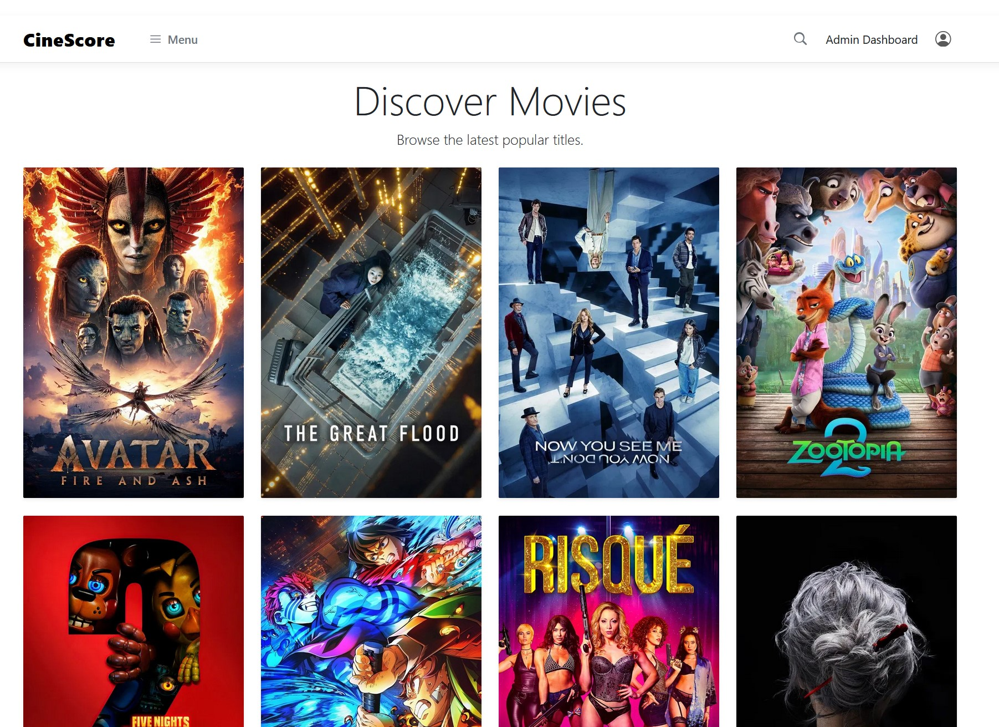
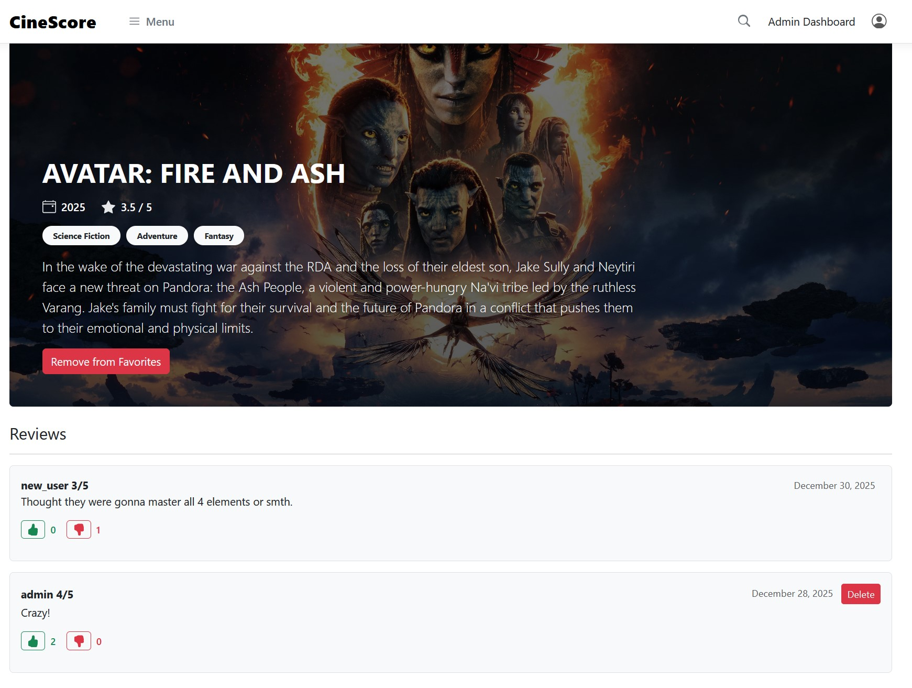
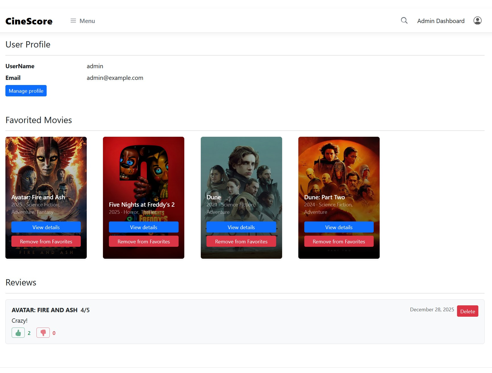
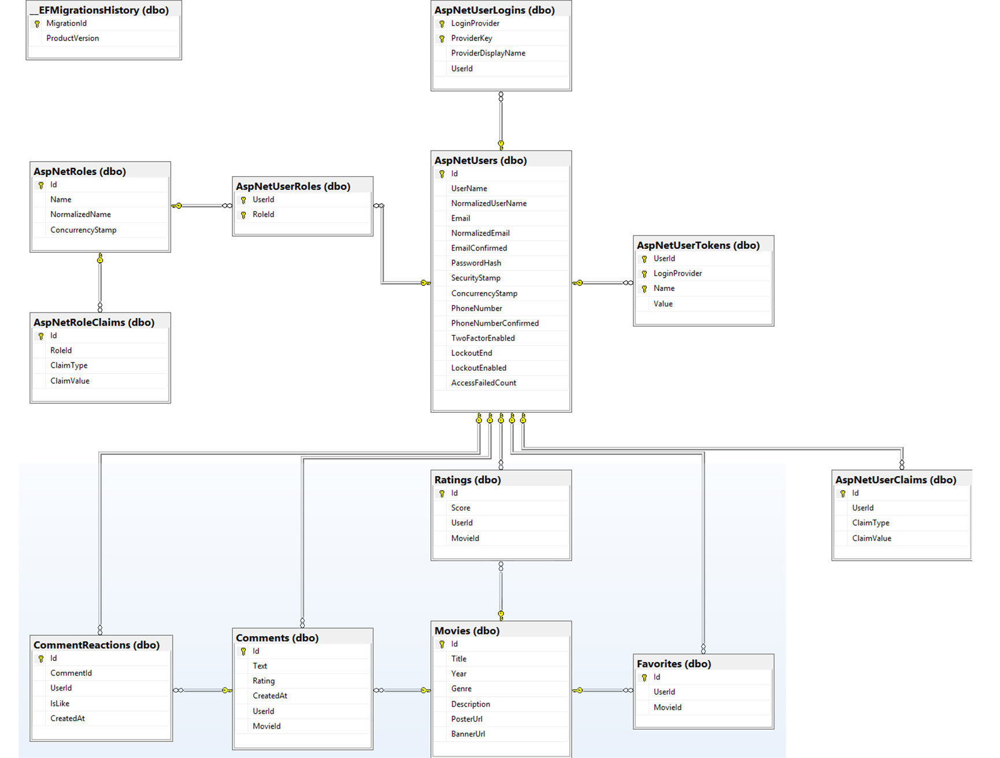

# CineScore - spletna aplikacija
 
Člana ekipe:

63240036 **Tilen Butara**  
63230009 **Luka Ažman**

## Splošen Opis:
Spletna aplikacija CineScore je namenjena pregledu ocen in ocenjevanje filmov, ki so deljeni po letu izdaje, žanru in oceni, kar uporabnikom omogoča lažje iskanje po željenem atributu. Uporabniki imajo možnost registracije in prijave v račun, kar služi kot shramba vseh ocen in komentarjev, ki jih je uporabnik objavil, poleg tega bo račun imel tudi funkcije kot so "Favorites", "Watchlist", ...

#### Spletna Stran:
Spletna stran se bo delila na dva dela: uporabniški, ki bo dostopen vsem in bo vseboval vse zgoraj navedene funkcije in upraviteljski, ki bo dostopen le administratorjem in uporabljen za upravljanje z aplikacijo. Predvidena sestava spletne strani:

##### Uporabniški del:
Začetna stran kjer so navedeni filmi, Registracija/Prijava računa, Stran za upravljanje z računom, Stran za ocenjevanje filmov, Favorite list in Watchlist.
##### Upraviteljski del:
Stran za urejanje s filmi in Stran za urejanje z uporabniškimi računi.

## API
Skrivnosti niso shranjene v repozitoriju. Za lokalni razvoj jih nastavi z `dotnet user-secrets`, v Azure pa z App Service settings/environment variables. Primer:

```bash
dotnet user-secrets set "ConnectionStrings:DefaultConnection" "<connection-string>"
dotnet user-secrets set "ApiKey" "<api-key>"
dotnet user-secrets set "Tmdb:ApiKey" "<tmdb-api-key>"
dotnet user-secrets set "Tmdb:ReadAccessToken" "<tmdb-read-access-token>"
dotnet user-secrets set "BootstrapAdmin:Email" "admin@example.com"
dotnet user-secrets set "BootstrapAdmin:Username" "admin"
dotnet user-secrets set "BootstrapAdmin:Password" "<strong-password>"
```

Za Azure uporabi ekvivalente z `__`, na primer `ConnectionStrings__AzureConn`, `Tmdb__ApiKey`, `Tmdb__ReadAccessToken`, `ApiKey` in `BootstrapAdmin__Password`.
REST API je na lokaciji `/api/v1/movies` in vrača podatke v JSON formatu. Za dostop je potreben API ključ, ki se pošlje v glavi `ApiKey`. Ključ nastavimo v `appsettings.json` (`ApiKey`), za produkcijo pa ga konfiguriramo preko spremenljivke okolja ali skrivnosti za Azure Web App.

#### Swagger dokumentacija
Swagger UI je na voljo na `/swagger` in prikazuje vse CRUD operacije za filme skupaj z možnostjo dodajanja API ključa v glavi zahteve.

##### Primeri klicev

Pridobivanje filmov:
```bash
curl -H "ApiKey: <tvoj_kljuc>" https://<tvoj-host>/api/v1/movies
```

Dodajanje novega filma:
```bash
curl -X POST -H "Content-Type: application/json" -H "ApiKey: <tvoj_kljuc>" \
  -d '{ "title": "Inception", "year": 2010, "genre": "Sci-Fi", "description": "Heist v sanjah" }' \
  https://<localhost:####>/api/v1/movies
```

## Razdelitev dela
Tukaj je opisano katere dele naloge je opravil določen član. Naloge so namenoma imenovane bolj splošno, saj sva obadva imela opravka s
skoraj vsemi deli spletne aplikacije, zato spodaj navedeni deli zgolj določajo kdo je naredil večji del tega dela naloge.

#### Tilen Butara (63240036):
- User dashboard
- Favorite function
- Admin dashboard
- Android app
- Azure database, webb app, auto-deploy
- Readme.md

#### Luka Ažman (63230009):
- Css Styling 
- Swagger, Rest, tmdb API
- API auth
- Movie search
- Like/Dislike function
- Readme.md

## Slike
Tukaj so slike, ki prikazujejo spletno stran, za slike **Android aplikacije** obiščite: "https://github.com/butarca/CineScore-android"

   

#### Podatkovna baza
Lastne tabele (Slika 4)
- Movies: filmi z osnovnimi podatki (naslov, leto, žanr, opis, URL za poster/banner) in povezavami na ocene in komentarje.
- Ratings: ocene filmov, vsaka vrstica ima svojo oceno, referenco na uporabnika in film (UserId, MovieId).
- Comments: komentarji za filme, vsebujejo besedilo, število zvezdic (Rating), čas nastanka ter povezave na uporabnika in film.
- Favorites: povezava uporabnik–film za shranjene priljubljenh filmov (UserId, MovieId).
- CommentReactions: odzivi na komentarje (like/dislike), z referenco na komentar in uporabnika, s časom nastanka.

Ostale tabele pa so s Framework (Identity, EF) in služijo avtentikaciji/avtorizaciji ter sledenju migracij.


